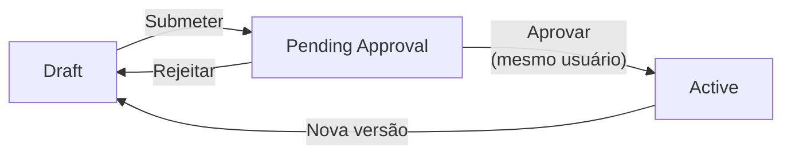
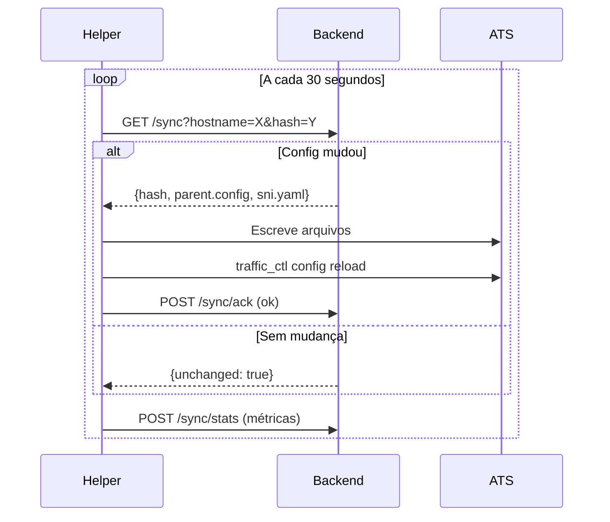

# ATS Proxy Manager - Resumo do Projeto

**Data**: Fevereiro 2025  
**Sessão**: Arquitetura e Implementação

---

## 1. Projeto Inicial: ATS Local Proxy (ATS)

### 1.1 Problema Original

Aplicações no Kubernetes precisavam configurar manualmente `HTTP_PROXY`, `HTTPS_PROXY` e `NO_PROXY`, gerando:

- Erros de digitação em IPs/domínios
- Requisições internas vazando para proxy externo
- Incidentes de conectividade difíceis de diagnosticar
- Overhead operacional em mudanças de rede

### 1.2 Solução Implementada

Proxy interno centralizado usando **Apache Traffic Server 10.x** que roteia automaticamente:

| Destino | Ação |
|---------|------|
| `10.0.0.0/8`, `172.16.0.0/12`, `192.168.0.0/16` | DIRECT |
| `198.18.0.0/16` | DIRECT |
| `*.eec`, `*.eeca`, `*.eeco` | DIRECT |
| `*.svc.cluster.local`, `*.cluster.local` | DIRECT |
| **Todo o resto** | PARENT (proxy corporativo) |

### 1.3 Configuração do Proxy

| Parâmetro | Valor |
|-----------|-------|
| Nome do container | `ATS_local_proxy` |
| Porta | `8153` |
| Proxy corporativo primário | `10.96.215.26:3128` |
| Proxy corporativo secundário | `10.253.16.93:3128` |
| Failover | `round_robin=strict` |

### 1.4 Benefício para Aplicações

```yaml
# ANTES: 3 variáveis, erros frequentes
env:
  - HTTP_PROXY: "http://10.96.215.26:3128"
  - HTTPS_PROXY: "http://10.96.215.26:3128"
  - NO_PROXY: "localhost,127.0.0.1,10.0.0.0/8,172.16.0.0/12,..."

# DEPOIS: 2 variáveis, zero configuração de bypass
env:
  - HTTP_PROXY: "http://ATS_local_proxy:8153"
  - HTTPS_PROXY: "http://ATS_local_proxy:8153"
```

### 1.5 Documentação Criada (ats-proxy/)

| Arquivo | Descrição |
|---------|-----------|
| `README.md` | Visão geral e quick start |
| `docs/IMPLEMENTATION.md` | Documento de implementação completo |
| `docs/DIAGRAMS.md` | Diagramas Mermaid para apresentações |
| `docs/RUNBOOK.md` | Procedimentos operacionais SRE |
| `docs/ONBOARDING.md` | Guia para novos membros do time |
| `docs/QUICK-REFERENCE.md` | Cheat sheet para NOC |
| `docs/ARCHITECTURE.md` | Arquitetura detalhada |
| `config/*` | Arquivos de configuração ATS |

---

## 2. Projeto: ATS Proxy Manager (Sistema de Gerenciamento)

### 2.1 Objetivo

Interface gráfica para gerenciar configurações dos proxies, eliminando edição manual de arquivos e centralizando o controle.

### 2.2 Arquitetura

```
┌─────────────────────────────────────────────────────────────────────────────┐
│                              ATS Proxy Manager                               │
├─────────────────────────────────────────────────────────────────────────────┤
│                                                                              │
│   ┌─────────────┐      ┌─────────────┐      ┌─────────────────────────────┐ │
│   │  Frontend   │─────▶│   Backend   │◀─────│         Helpers             │ │
│   │  (Next.js)  │      │    (Go)     │      │  (Go - em cada proxy)       │ │
│   └─────────────┘      └──────┬──────┘      └─────────────────────────────┘ │
│                               │                                              │
│                        ┌──────▼──────┐                                       │
│                        │ PostgreSQL  │                                       │
│                        │   + Redis   │                                       │
│                        └─────────────┘                                       │
│                                                                              │
└─────────────────────────────────────────────────────────────────────────────┘
                                    │
                    ┌───────────────┼───────────────┐
                    ▼               ▼               ▼
            ┌─────────────┐ ┌─────────────┐ ┌─────────────┐
            │   Proxy 1   │ │   Proxy 2   │ │   Proxy N   │
            │ ATS + Helper│ │ ATS + Helper│ │ ATS + Helper│
            └─────────────┘ └─────────────┘ └─────────────┘
```

### 2.3 Componentes

| Componente | Tecnologia | Função |
|------------|------------|--------|
| **Frontend** | Next.js | Interface web para gerenciamento |
| **Backend** | Go | API REST + lógica de merge de configs |
| **Helper** | Go | Sincroniza configs nos proxies (polling) |
| **Database** | PostgreSQL 16 | Persistência |
| **Cache** | Redis | Cache de sessões e configs |
| **Proxy** | Apache Traffic Server 10 | Proxy HTTP/HTTPS com failover |

### 2.4 Especificações Técnicas

| Parâmetro | Valor | Justificativa |
|-----------|-------|---------------|
| Modelo de config | Por grupo/tenant | Usuário seleciona quais proxies recebem qual config |
| Sync interval | 30 segundos | Balanço entre responsividade e carga |
| Retry inicial | 30 segundos | Tempo razoável para recuperação |
| Retry máximo | 3 minutos | Evita sobrecarga em falhas prolongadas |
| Estratégia retry | Exponential backoff | 30s → 60s → 120s → 180s (max) |
| Resiliência | Última config válida | Proxy continua funcionando se backend cair |
| Comunicação | Polling | Mais resiliente que WebSocket para infra instável |
| Auth Helper | Nenhuma | Ambiente controlado, simplifica deploy |
| Auth Frontend/Backend | JWT + beacon 30s | Stateless, detecta sessão inativa |

### 2.5 Roles de Usuário

| Role | Permissões |
|------|------------|
| **root** | Tudo + criar/gerenciar admins (usuário inicial do sistema) |
| **admin** | CRUD configs, aprovar, ver logs, criar usuários regular |
| **regular** | Somente leitura (vê tudo mas não altera) |

### 2.6 Fluxo de Aprovação (2 etapas)



1. Admin cria/edita config (status: `draft`)
2. Admin submete para aprovação (status: `pending_approval`)
3. **Mesmo admin** confirma aprovação (2ª verificação consciente)
4. Config fica ativa e é distribuída aos proxies automaticamente

### 2.7 Funcionalidades Especiais

| Funcionalidade | Descrição |
|----------------|-----------|
| **Captura de logs** | Ativável por proxy, máximo 5 minutos para evitar excesso de dados |
| **Métricas coletadas** | Conexões ativas, total conexões, cache hits/misses, erros |
| **Audit trail** | Todas modificações registradas com quem/quando/o quê |
| **Dashboard** | Proxies online/offline, stats agregadas, configs pendentes |
| **Failover** | Dois parent proxies com fallback automático |

### 2.8 Documentação Criada (ATS-proxy-manager/)

| Arquivo | Descrição |
|---------|-----------|
| `README.md` | Visão geral do projeto |
| `docs/ARCHITECTURE.md` | Arquitetura completa com diagramas ER, state machine |
| `docs/API_CONTRACT.md` | Contrato da API REST (todos endpoints documentados) |
| `docs/SEQUENCES.md` | 7 diagramas de sequência detalhados |
| `database/schema.sql` | Schema PostgreSQL completo com views e functions |
| `helper/` | Código Go completo do Helper |

### 2.9 Estrutura do Helper Go

```
helper/
├── cmd/helper/main.go           # Entry point com loop principal
├── internal/
│   ├── config/config.go         # Estrutura de configuração
│   ├── sync/client.go           # Cliente HTTP para backend
│   ├── sync/backoff.go          # Exponential backoff
│   └── ats/manager.go           # Gerenciamento ATS (reload, stats, logs)
├── Dockerfile
└── go.mod
```

**Flags do Helper:**
```bash
./helper \
  --backend-url http://backend:8080 \
  --config-id config-prod-01 \
  --hostname $(hostname) \
  --sync-interval 30s \
  --config-dir /opt/etc/trafficserver
```

---

## 3. Modelo de Dados

### 3.1 Entidades Principais

```
USER ──────────── AUDIT_LOG
  │                   │
  └──── CONFIG ───────┘
          │
    ┌─────┼─────┬─────────────┐
    │     │     │             │
DOMAIN  IP_RANGE  PARENT    CONFIG_PROXY
 RULE    RULE    PROXY          │
                                │
                             PROXY ──── PROXY_STATS
                                   └─── PROXY_LOGS
```

### 3.2 Status de Configuração

| Status | Descrição | Ações Permitidas |
|--------|-----------|------------------|
| `draft` | Em edição | Editar, submeter |
| `pending_approval` | Aguardando aprovação | Aprovar, rejeitar |
| `approved` | Aprovada | (transição automática) |
| `active` | Em uso pelos proxies | Criar nova versão |

---

## 4. Failover de Parent Proxy

### 4.1 Configuração ATS

```bash
# parent.config
dest_domain=. parent="10.96.215.26:3128;10.253.16.93:3128" round_robin=strict
```

### 4.2 Comportamento

| Cenário | Ação |
|---------|------|
| Primário OK | Usa `10.96.215.26:3128` |
| Primário falha | Marca como DOWN, usa `10.253.16.93:3128` |
| Após `retry_time` (300s) | Tenta primário novamente |
| Primário volta | Retorna a usar primário |

### 4.3 Parâmetros de Failover (records.yaml)

```yaml
records:
  http:
    parent_proxy:
      fail_threshold: 10        # Falhas para marcar como DOWN
      retry_time: 300           # Segundos para tentar novamente
      total_connect_attempts: 4 # Tentativas totais
      per_parent_connect_attempts: 2  # Tentativas por parent
```

---

## 5. Fluxo de Sincronização



---

## 6. Arquivos Gerados

### 6.1 Pacote: ATS-local-proxy.zip

Configuração do proxy ATS com documentação completa para SRE.

### 6.2 Pacote: ATS-proxy-manager.zip

Sistema de gerenciamento completo:
- Documentação de arquitetura
- Contrato de API
- Diagramas de sequência
- Schema do banco de dados
- Helper Go funcional
- Dockerfiles para todos os componentes

---

## 7. Stack Tecnológica Final

| Camada | Tecnologia | Versão |
|--------|------------|--------|
| Frontend | Next.js | 14+ |
| Backend | Go | 1.22+ |
| Database | PostgreSQL | 16 |
| Cache | Redis | 7+ |
| Proxy | Apache Traffic Server | 10.x |
| Container | Docker | - |
| Orquestração | Docker Compose / Kubernetes | - |

---

## 8. Decisões de Arquitetura

| Decisão | Escolha | Motivo |
|---------|---------|--------|
| Comunicação Helper↔Backend | Polling 30s | Resiliente a falhas de rede |
| Auth Helper | Nenhuma | Simplicidade, ambiente controlado |
| Auth UI/API | JWT + Beacon | Stateless, detecta inatividade |
| Retry strategy | Exponential backoff | Evita sobrecarga em falhas |
| Aprovação | 2 passos, mesmo usuário | Confirmação consciente |
| Logs temporários | Max 5 min | Evita excesso de dados |
| Failover proxy | round_robin=strict | Primário com fallback |

---

## 9. Próximos Passos

1. ✅ Arquitetura definida
2. ✅ Documentação criada
3. ✅ Schema do banco criado
4. ✅ Helper Go implementado
5. ⏳ Backend Go (API completa)
6. ⏳ Frontend Next.js (baseado em StressTestPlatform)
7. ⏳ Dockerfiles e docker-compose
8. ⏳ Testes (unit + integration)
9. ⏳ Deploy em ambiente de desenvolvimento


