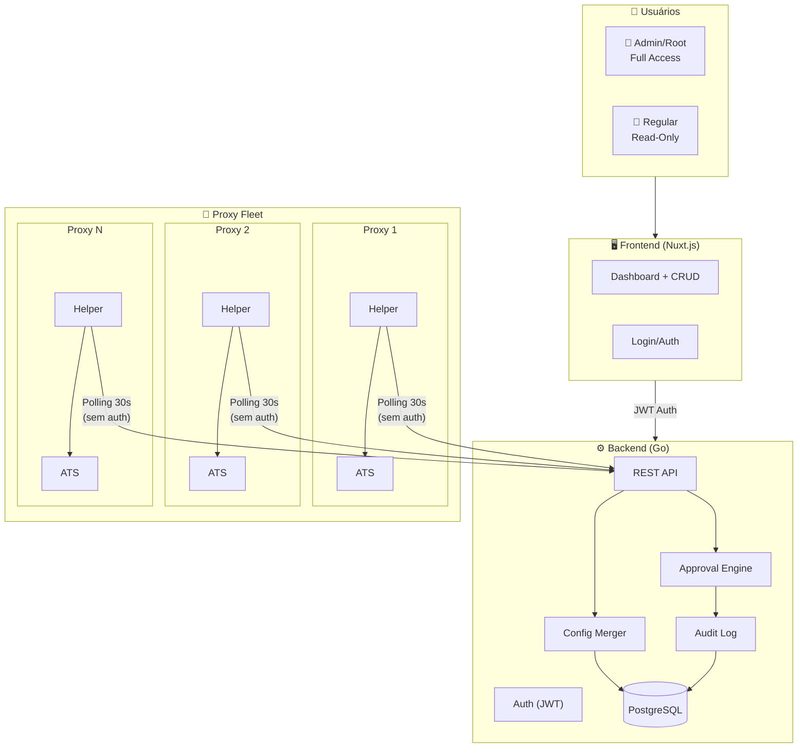
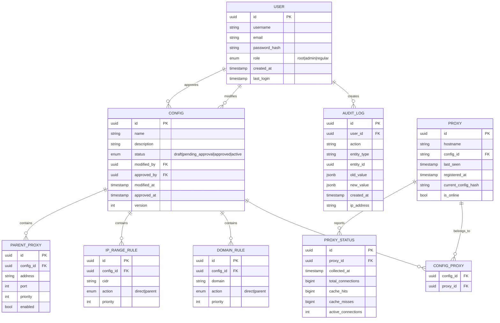
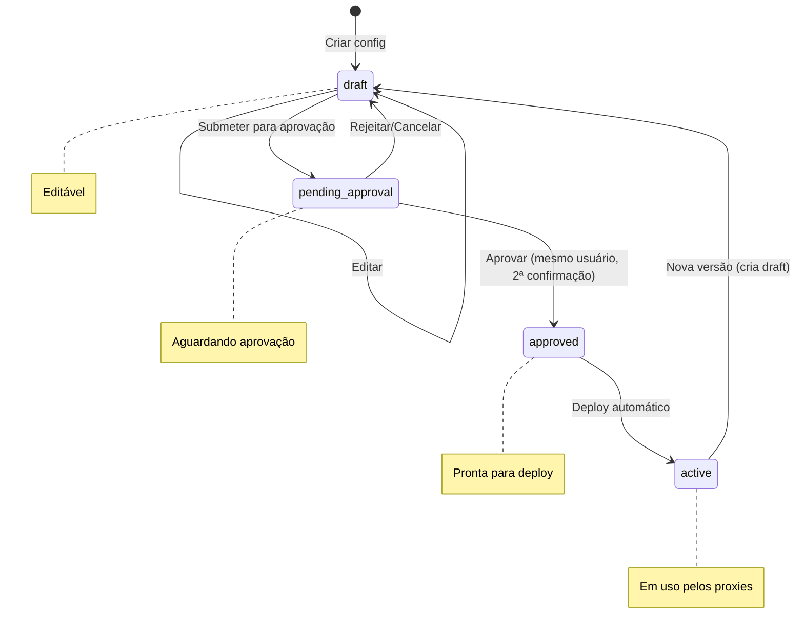
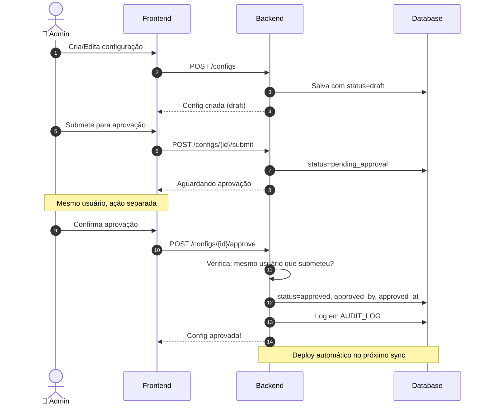
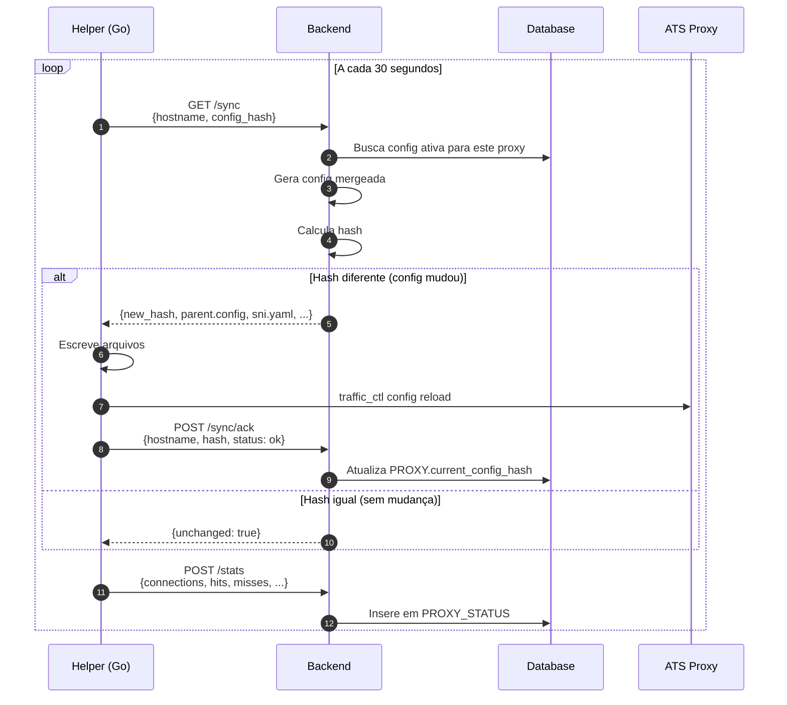
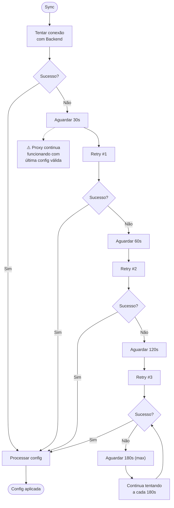
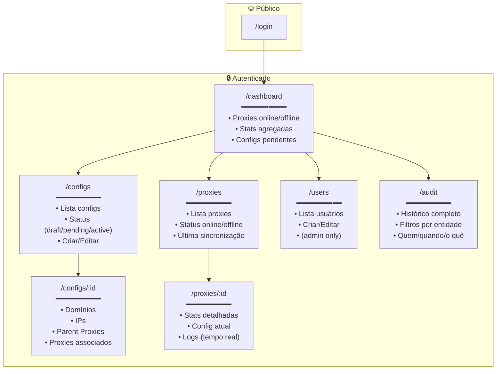
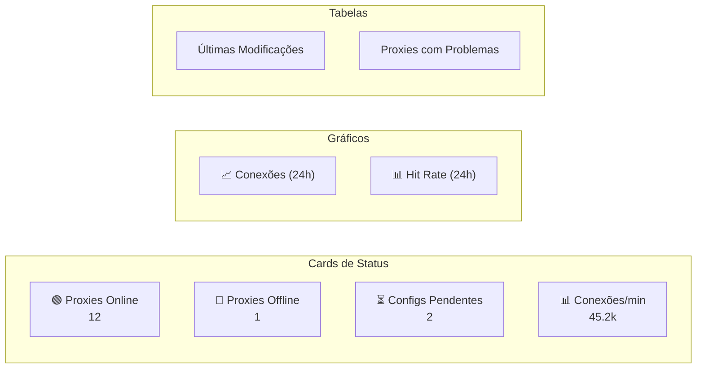
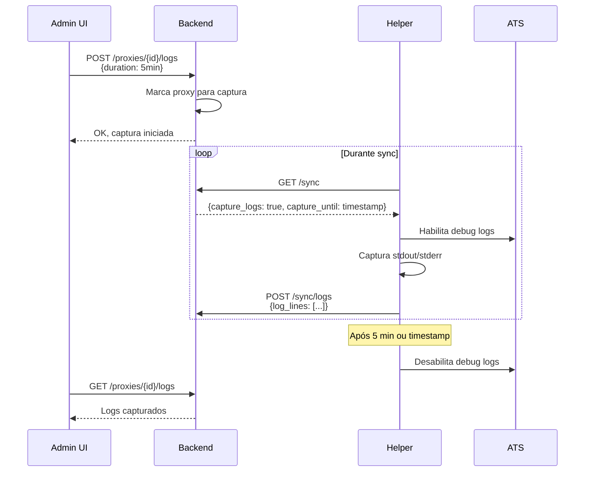
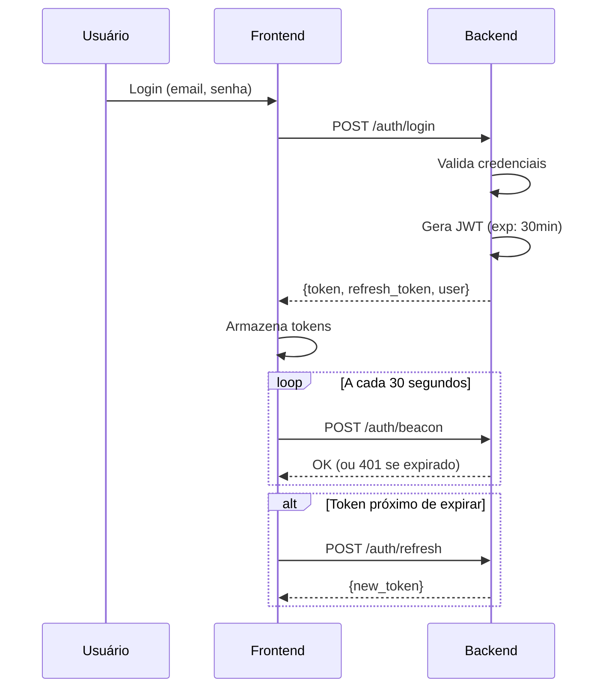

# IDF Proxy Manager - Documento de Arquitetura

**Versão**: 1.0  
**Data**: Fevereiro 2025  
**Status**: Em Refinamento

---

## 1. Visão Geral

Sistema de gerenciamento centralizado para configurações dos proxies IDF Local Proxy, composto por:

| Componente | Tecnologia | Função |
|------------|------------|--------|
| **Frontend** | Nuxt.js | Interface de gerenciamento |
| **Backend** | Go / Node.js | API REST + lógica de merge |
| **Helper** | Go | Sincroniza configs nos proxies |
| **Database** | PostgreSQL | Persistência |

---

## 2. Arquitetura Geral



---

## 3. Modelo de Dados

### 3.1 Entidades



### 3.2 Status de Configuração (State Machine)



---

## 4. Fluxo de Configuração

### 4.1 Criação e Aprovação



### 4.2 Sync com Proxies



### 4.3 Retry com Exponential Backoff



---

## 5. API Endpoints

### 5.1 Autenticação

| Método | Endpoint | Descrição | Auth |
|--------|----------|-----------|------|
| POST | `/auth/login` | Login, retorna JWT | - |
| POST | `/auth/refresh` | Renova token | JWT |
| POST | `/auth/beacon` | Keep-alive (30s) | JWT |
| POST | `/auth/logout` | Invalida token | JWT |

### 5.2 Usuários (Admin/Root)

| Método | Endpoint | Descrição | Role |
|--------|----------|-----------|------|
| GET | `/users` | Lista usuários | admin |
| POST | `/users` | Cria usuário | admin |
| PUT | `/users/{id}` | Edita usuário | admin |
| DELETE | `/users/{id}` | Remove usuário | root |

### 5.3 Configurações

| Método | Endpoint | Descrição | Role |
|--------|----------|-----------|------|
| GET | `/configs` | Lista configs | all |
| GET | `/configs/{id}` | Detalhe config | all |
| POST | `/configs` | Cria config | admin |
| PUT | `/configs/{id}` | Edita config (draft) | admin |
| DELETE | `/configs/{id}` | Remove config | admin |
| POST | `/configs/{id}/submit` | Submete para aprovação | admin |
| POST | `/configs/{id}/approve` | Aprova config | admin |
| POST | `/configs/{id}/reject` | Rejeita/volta para draft | admin |

### 5.4 Proxies

| Método | Endpoint | Descrição | Role |
|--------|----------|-----------|------|
| GET | `/proxies` | Lista proxies registrados | all |
| GET | `/proxies/{id}` | Detalhe + stats | all |
| GET | `/proxies/{id}/logs` | Ativa captura de logs (5min) | admin |
| DELETE | `/proxies/{id}` | Remove proxy | admin |

### 5.5 Sync (Helper - Sem Auth)

| Método | Endpoint | Descrição |
|--------|----------|-----------|
| GET | `/sync?hostname=X&hash=Y` | Busca config |
| POST | `/sync/ack` | Confirma aplicação |
| POST | `/sync/stats` | Envia métricas |
| POST | `/sync/register` | Registra novo proxy |

### 5.6 Audit

| Método | Endpoint | Descrição | Role |
|--------|----------|-----------|------|
| GET | `/audit` | Lista audit log | admin |
| GET | `/audit?entity={id}` | Histórico de entidade | admin |

---

## 6. Frontend (Nuxt.js)

### 6.1 Páginas



### 6.2 Componentes de Dashboard



---

## 7. Helper (Go)

### 7.1 Estrutura do Projeto

```
idf-proxy-helper/
├── cmd/
│   └── helper/
│       └── main.go
├── internal/
│   ├── config/
│   │   ├── config.go        # Estrutura de configuração
│   │   └── loader.go        # Carrega flags/env
│   ├── sync/
│   │   ├── client.go        # HTTP client para backend
│   │   ├── sync.go          # Lógica de sincronização
│   │   └── backoff.go       # Exponential backoff
│   ├── ats/
│   │   ├── writer.go        # Escreve parent.config, sni.yaml
│   │   ├── reload.go        # Executa traffic_ctl reload
│   │   └── stats.go         # Coleta métricas do ATS
│   ├── logs/
│   │   └── capture.go       # Captura logs temporária
│   └── models/
│       └── types.go         # Tipos compartilhados
├── go.mod
├── go.sum
└── Dockerfile
```

### 7.2 Flags e Configuração

```bash
./helper \
  --backend-url http://backend.api:8080 \
  --config-id config-prod-01 \
  --hostname $(hostname) \
  --sync-interval 30s \
  --config-dir /opt/etc/trafficserver \
  --log-level info
```

### 7.3 Fluxo Principal

```go
// Pseudo-código do loop principal
func main() {
    cfg := config.Load()
    client := sync.NewClient(cfg.BackendURL)
    
    // Registra no backend
    client.Register(cfg.Hostname, cfg.ConfigID)
    
    ticker := time.NewTicker(cfg.SyncInterval)
    for range ticker.C {
        err := syncConfig(client, cfg)
        if err != nil {
            handleErrorWithBackoff(err)
            continue
        }
        
        // Envia stats
        stats := ats.CollectStats()
        client.SendStats(cfg.Hostname, stats)
    }
}

func syncConfig(client *sync.Client, cfg *config.Config) error {
    currentHash := getCurrentConfigHash()
    
    resp, err := client.GetConfig(cfg.Hostname, currentHash)
    if err != nil {
        return err // Será tratado com backoff
    }
    
    if resp.Unchanged {
        return nil // Nada a fazer
    }
    
    // Escreve novos arquivos
    ats.WriteParentConfig(resp.ParentConfig)
    ats.WriteSNIConfig(resp.SNIConfig)
    
    // Reload
    if err := ats.Reload(); err != nil {
        return err
    }
    
    // Confirma
    client.Ack(cfg.Hostname, resp.Hash, "ok")
    saveConfigHash(resp.Hash)
    
    return nil
}
```

### 7.4 Captura de Logs (Opcional)



---

## 8. Segurança

### 8.1 Autenticação



### 8.2 Autorização (RBAC)

| Role | Configs | Proxies | Users | Audit |
|------|---------|---------|-------|-------|
| **root** | CRUD + Approve | View + Logs | CRUD (incl. admins) | View |
| **admin** | CRUD + Approve | View + Logs | CRUD (exceto root/admin) | View |
| **regular** | Read | Read | - | Read |

### 8.3 Helper (Sem Auth)

O Helper não autentica porque:
- Roda dentro do container do proxy
- Backend valida por hostname registrado
- Não expõe dados sensíveis
- Config é read-only do ponto de vista do helper

---

## 9. Métricas Coletadas

### 9.1 Do ATS (via traffic_ctl)

```bash
# Conexões
proxy.process.http.current_client_connections
proxy.process.http.current_server_connections
proxy.process.http.total_client_connections
proxy.process.http.total_server_connections

# Cache
proxy.process.cache.ram_cache.hits
proxy.process.cache.ram_cache.misses

# Erros
proxy.process.http.err_client_abort_count_stat
proxy.process.http.err_connect_fail_count_stat
```

### 9.2 Agregações no Backend

| Métrica | Agregação | Retenção |
|---------|-----------|----------|
| Conexões por proxy | Por minuto | 7 dias |
| Hit rate por proxy | Por minuto | 7 dias |
| Total conexões fleet | Por minuto | 30 dias |
| Erros por proxy | Por minuto | 7 dias |

---

## 10. Deploy

### 10.1 Docker Compose (Dev/Homolog)

```yaml
version: '3.8'

services:
  # PostgreSQL
  db:
    image: postgres:15
    environment:
      POSTGRES_DB: idf_proxy_manager
      POSTGRES_USER: idf
      POSTGRES_PASSWORD: secret
    volumes:
      - pgdata:/var/lib/postgresql/data

  # Backend (Go)
  backend:
    build: ./backend
    environment:
      DATABASE_URL: postgres://idf:secret@db:5432/idf_proxy_manager
      JWT_SECRET: super-secret-key
    ports:
      - "8080:8080"
    depends_on:
      - db

  # Frontend (Nuxt.js)
  frontend:
    build: ./frontend
    environment:
      API_URL: http://backend:8080
    ports:
      - "3000:3000"
    depends_on:
      - backend

  # Proxy com Helper (exemplo)
  proxy-01:
    build: ./proxy
    environment:
      HELPER_BACKEND_URL: http://backend:8080
      HELPER_CONFIG_ID: config-prod-01
      HELPER_HOSTNAME: proxy-01
    ports:
      - "8153:8153"
    depends_on:
      - backend

volumes:
  pgdata:
```

---

## 11. Próximos Passos

### Fase 1: MVP
- [ ] Backend: Auth + CRUD Configs + Sync endpoint
- [ ] Helper: Sync básico + reload
- [ ] Frontend: Login + Dashboard + Configs

### Fase 2: Aprovação
- [ ] Backend: Workflow de aprovação
- [ ] Frontend: UI de aprovação
- [ ] Audit log

### Fase 3: Métricas
- [ ] Helper: Coleta de stats
- [ ] Backend: Agregação
- [ ] Frontend: Gráficos

### Fase 4: Logs
- [ ] Helper: Captura de logs
- [ ] Frontend: Visualização real-time

---

## 12. Decisões Técnicas

| Decisão | Escolha | Motivo |
|---------|---------|--------|
| Comunicação Helper↔Backend | Polling 30s | Resiliente a falhas de rede |
| Auth Helper | Nenhuma | Simplicidade, roda em ambiente controlado |
| Auth Frontend/Backend | JWT + Beacon 30s | Stateless, detecta sessão inativa |
| Retry | Exponential backoff até 3min | Evita sobrecarga em falhas |
| Aprovação | 2 passos, mesmo usuário | Confirmação consciente |
| Logs temporários | Max 5 min | Evita excesso de dados |
