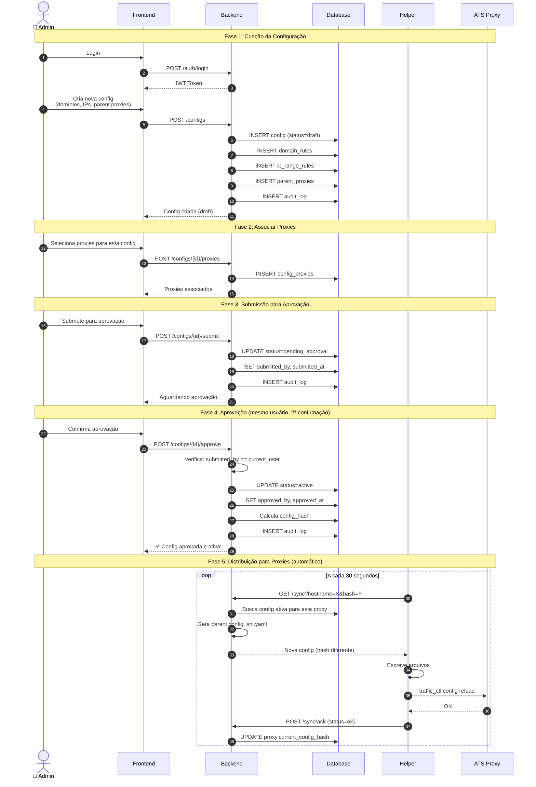
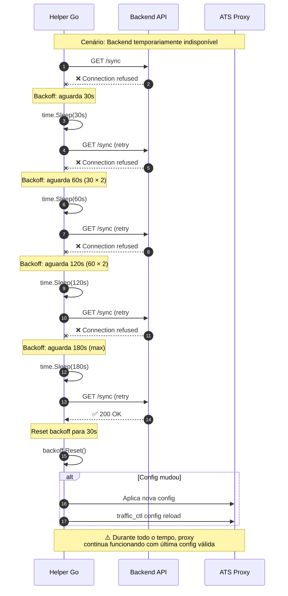
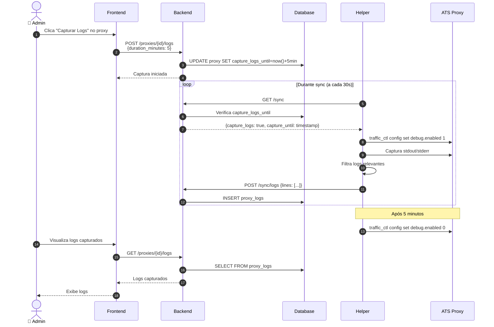
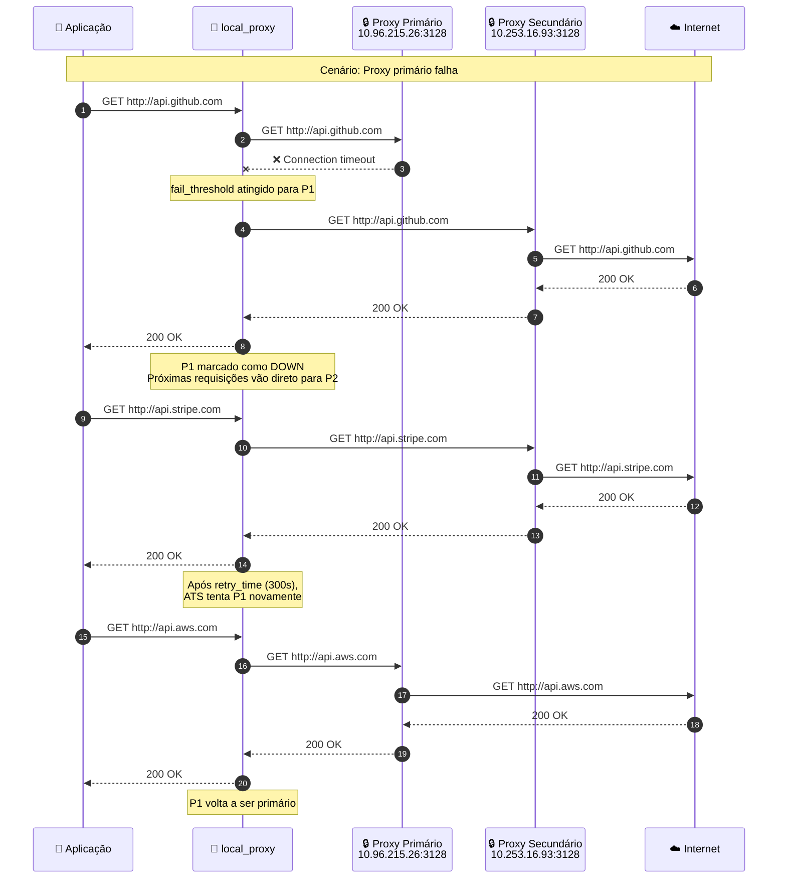
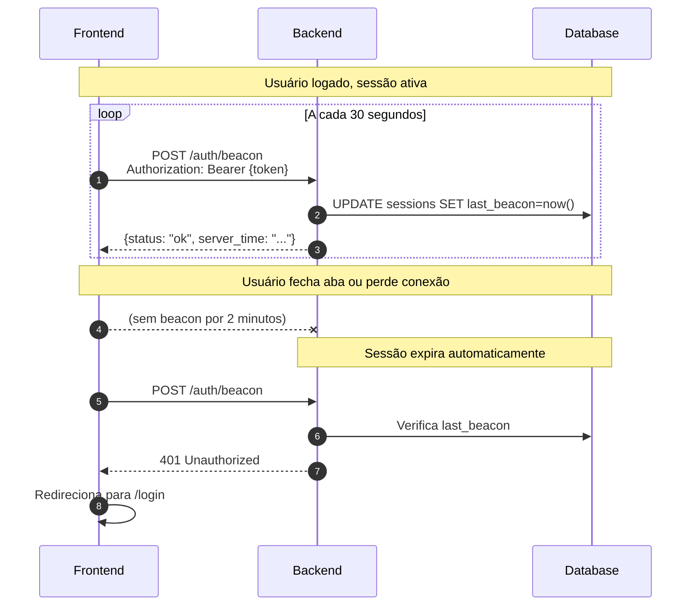
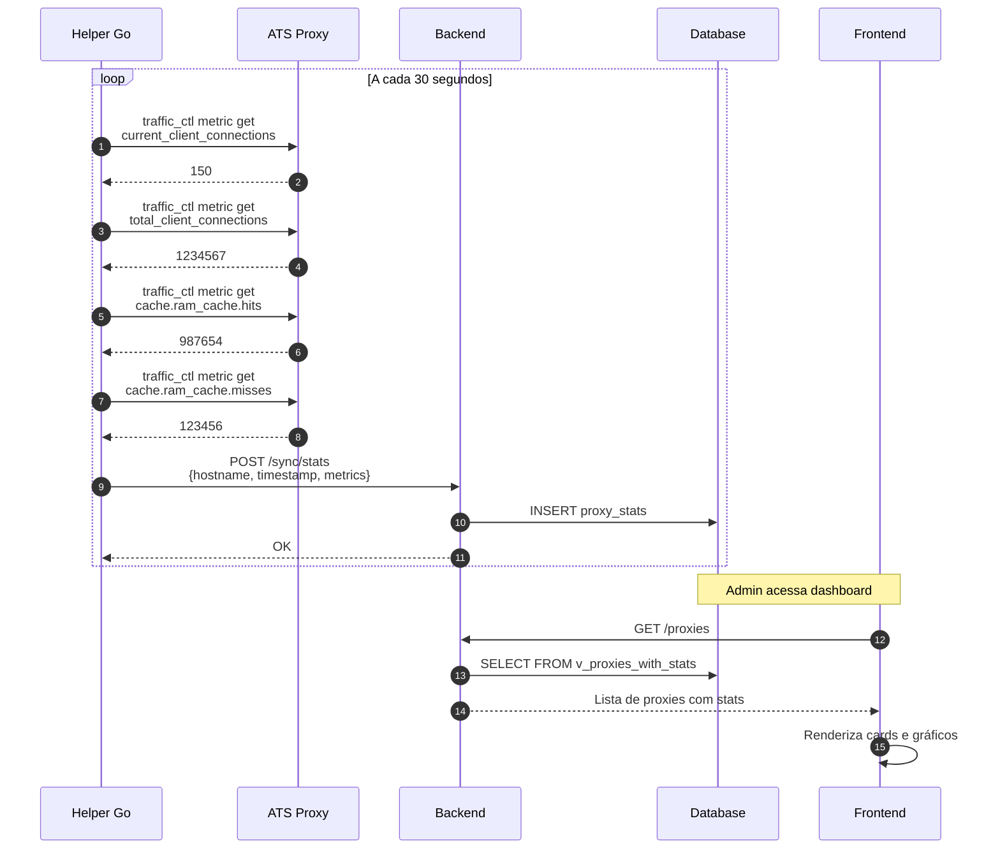
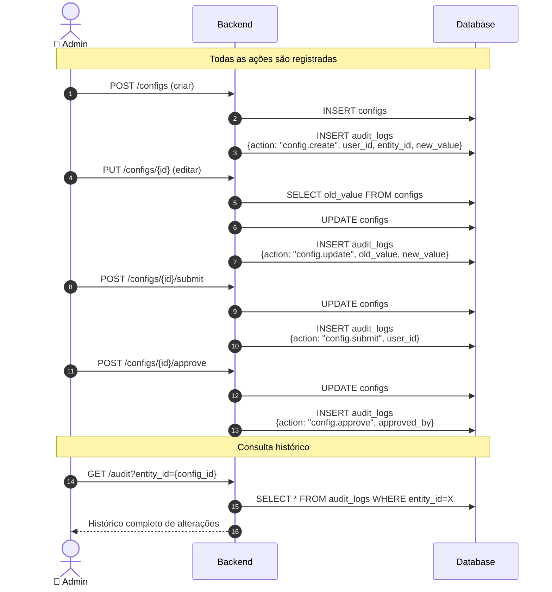

# ATS Proxy Manager - Fluxos de Sequência

## 1. Fluxo Completo: Criar e Aprovar Configuração

---

## 2. Fluxo: Helper com Retry e Backoff

---

## 3. Fluxo: Captura de Logs em Tempo Real

---

## 4. Fluxo: Failover entre Parent Proxies

---

## 5. Fluxo: Beacon JWT (Keep-Alive)

---

## 6. Fluxo: Coleta de Estatísticas

---

## 7. Fluxo: Audit Trail Completo

