# ATS Proxy Manager - Fluxos de Sequência

## 1. Fluxo Completo: Criar e Aprovar Configuração

```mermaid
sequenceDiagram
    autonumber
    
    actor Admin as 🔑 Admin
    participant UI as Frontend
    participant API as Backend
    participant DB as Database
    participant Helper as Helper
    participant ATS as ATS Proxy

    Note over Admin,ATS: Fase 1: Criação da Configuração

    Admin->>UI: Login
    UI->>API: POST /auth/login
    API-->>UI: JWT Token
    
    Admin->>UI: Cria nova config<br/>(domínios, IPs, parent proxies)
    UI->>API: POST /configs
    API->>DB: INSERT config (status=draft)
    API->>DB: INSERT domain_rules
    API->>DB: INSERT ip_range_rules
    API->>DB: INSERT parent_proxies
    API->>DB: INSERT audit_log
    API-->>UI: Config criada (draft)

    Note over Admin,ATS: Fase 2: Associar Proxies

    Admin->>UI: Seleciona proxies para esta config
    UI->>API: POST /configs/{id}/proxies
    API->>DB: INSERT config_proxies
    API-->>UI: Proxies associados

    Note over Admin,ATS: Fase 3: Submissão para Aprovação

    Admin->>UI: Submete para aprovação
    UI->>API: POST /configs/{id}/submit
    API->>DB: UPDATE status=pending_approval
    API->>DB: SET submitted_by, submitted_at
    API->>DB: INSERT audit_log
    API-->>UI: Aguardando aprovação

    Note over Admin,ATS: Fase 4: Aprovação (mesmo usuário, 2ª confirmação)

    Admin->>UI: Confirma aprovação
    UI->>API: POST /configs/{id}/approve
    API->>API: Verifica: submitted_by == current_user
    API->>DB: UPDATE status=active
    API->>DB: SET approved_by, approved_at
    API->>DB: Calcula config_hash
    API->>DB: INSERT audit_log
    API-->>UI: ✅ Config aprovada e ativa!

    Note over Admin,ATS: Fase 5: Distribuição para Proxies (automático)

    loop A cada 30 segundos
        Helper->>API: GET /sync?hostname=X&hash=Y
        API->>DB: Busca config ativa para este proxy
        API->>API: Gera parent.config, sni.yaml
        API-->>Helper: Nova config (hash diferente)
        
        Helper->>Helper: Escreve arquivos
        Helper->>ATS: traffic_ctl config reload
        ATS-->>Helper: OK
        
        Helper->>API: POST /sync/ack (status=ok)
        API->>DB: UPDATE proxy.current_config_hash
    end
```

---

## 2. Fluxo: Helper com Retry e Backoff

```mermaid
sequenceDiagram
    autonumber
    
    participant Helper as Helper Go
    participant API as Backend API
    participant ATS as ATS Proxy

    Note over Helper,ATS: Cenário: Backend temporariamente indisponível

    Helper->>API: GET /sync
    API--xHelper: ❌ Connection refused
    
    Note over Helper: Backoff: aguarda 30s
    Helper->>Helper: time.Sleep(30s)
    
    Helper->>API: GET /sync (retry #1)
    API--xHelper: ❌ Connection refused
    
    Note over Helper: Backoff: aguarda 60s (30 × 2)
    Helper->>Helper: time.Sleep(60s)
    
    Helper->>API: GET /sync (retry #2)
    API--xHelper: ❌ Connection refused
    
    Note over Helper: Backoff: aguarda 120s (60 × 2)
    Helper->>Helper: time.Sleep(120s)
    
    Helper->>API: GET /sync (retry #3)
    API--xHelper: ❌ Connection refused
    
    Note over Helper: Backoff: aguarda 180s (max)
    Helper->>Helper: time.Sleep(180s)
    
    Helper->>API: GET /sync (retry #4)
    API-->>Helper: ✅ 200 OK
    
    Note over Helper: Reset backoff para 30s
    Helper->>Helper: backoff.Reset()
    
    alt Config mudou
        Helper->>ATS: Aplica nova config
        Helper->>ATS: traffic_ctl config reload
    end

    Note over Helper,ATS: ⚠️ Durante todo o tempo, proxy<br/>continua funcionando com última config válida
```

---

## 3. Fluxo: Captura de Logs em Tempo Real

```mermaid
sequenceDiagram
    autonumber
    
    actor Admin as 🔑 Admin
    participant UI as Frontend
    participant API as Backend
    participant DB as Database
    participant Helper as Helper
    participant ATS as ATS Proxy

    Admin->>UI: Clica "Capturar Logs" no proxy
    UI->>API: POST /proxies/{id}/logs<br/>{duration_minutes: 5}
    API->>DB: UPDATE proxy SET capture_logs_until=now()+5min
    API-->>UI: Captura iniciada

    loop Durante sync (a cada 30s)
        Helper->>API: GET /sync
        API->>DB: Verifica capture_logs_until
        API-->>Helper: {capture_logs: true, capture_until: timestamp}
        
        Helper->>ATS: traffic_ctl config set debug.enabled 1
        Helper->>ATS: Captura stdout/stderr
        Helper->>Helper: Filtra logs relevantes
        Helper->>API: POST /sync/logs {lines: [...]}
        API->>DB: INSERT proxy_logs
    end

    Note over Helper,ATS: Após 5 minutos
    
    Helper->>ATS: traffic_ctl config set debug.enabled 0
    
    Admin->>UI: Visualiza logs capturados
    UI->>API: GET /proxies/{id}/logs
    API->>DB: SELECT FROM proxy_logs
    API-->>UI: Logs capturados
    UI-->>Admin: Exibe logs
```

---

## 4. Fluxo: Failover entre Parent Proxies

```mermaid
sequenceDiagram
    autonumber
    
    participant App as 🔷 Aplicação
    participant ATS as 🔶 local_proxy
    participant P1 as 🔒 Proxy Primário<br/>10.96.215.26:3128
    participant P2 as 🔒 Proxy Secundário<br/>10.253.16.93:3128
    participant Internet as ☁️ Internet

    Note over App,Internet: Cenário: Proxy primário falha

    App->>ATS: GET http://api.github.com
    
    ATS->>P1: GET http://api.github.com
    P1--xATS: ❌ Connection timeout
    
    Note over ATS: fail_threshold atingido para P1
    
    ATS->>P2: GET http://api.github.com
    P2->>Internet: GET http://api.github.com
    Internet-->>P2: 200 OK
    P2-->>ATS: 200 OK
    ATS-->>App: 200 OK

    Note over ATS: P1 marcado como DOWN<br/>Próximas requisições vão direto para P2

    App->>ATS: GET http://api.stripe.com
    ATS->>P2: GET http://api.stripe.com
    P2->>Internet: GET http://api.stripe.com
    Internet-->>P2: 200 OK
    P2-->>ATS: 200 OK
    ATS-->>App: 200 OK

    Note over ATS: Após retry_time (300s),<br/>ATS tenta P1 novamente

    App->>ATS: GET http://api.aws.com
    ATS->>P1: GET http://api.aws.com
    P1->>Internet: GET http://api.aws.com
    Internet-->>P1: 200 OK
    P1-->>ATS: 200 OK
    ATS-->>App: 200 OK

    Note over ATS: P1 volta a ser primário
```

---

## 5. Fluxo: Beacon JWT (Keep-Alive)

---

## 6. Fluxo: Coleta de Estatísticas

---

## 7. Fluxo: Audit Trail Completo

```mermaid
sequenceDiagram
    autonumber
    
    actor Admin as 🔑 Admin
    participant API as Backend
    participant DB as Database

    Note over Admin,DB: Todas as ações são registradas

    Admin->>API: POST /configs (criar)
    API->>DB: INSERT configs
    API->>DB: INSERT audit_logs<br/>{action: "config.create", user_id, entity_id, new_value}

    Admin->>API: PUT /configs/{id} (editar)
    API->>DB: SELECT old_value FROM configs
    API->>DB: UPDATE configs
    API->>DB: INSERT audit_logs<br/>{action: "config.update", old_value, new_value}

    Admin->>API: POST /configs/{id}/submit
    API->>DB: UPDATE configs
    API->>DB: INSERT audit_logs<br/>{action: "config.submit", user_id}

    Admin->>API: POST /configs/{id}/approve
    API->>DB: UPDATE configs
    API->>DB: INSERT audit_logs<br/>{action: "config.approve", approved_by}

    Note over Admin,DB: Consulta histórico

    Admin->>API: GET /audit?entity_id={config_id}
    API->>DB: SELECT * FROM audit_logs WHERE entity_id=X
    API-->>Admin: Histórico completo de alterações
```

